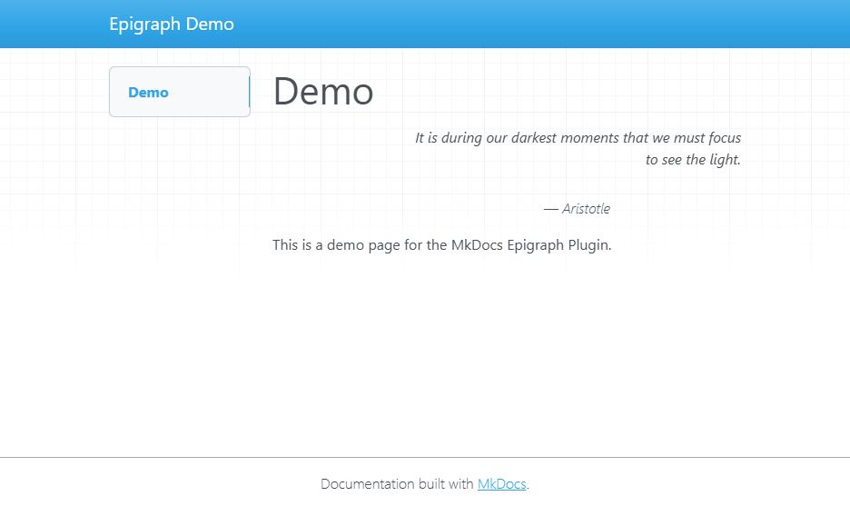

# MkDocs Epigraph Plugin

This plugin allows you to add epigraphs to your MkDocs pages. An epigraph is a short quotation or saying at the beginning of a book or chapter, intended to suggest its theme.

It is compatible with MkDocs Material.

## Installation

Install the plugin using pip:

```bash
pip install mkdocs-epigraph
```

Activate the plugin in your `mkdocs.yml`:

```yaml
plugins:
  - epigraph
```

## Usage

In you pages, you can add an epigraph in the YAML front matter:

```markdown
---
epigraph:
    text: "It is during our darkest moments that we must focus to see the light."
    source: Aristotle
---

# Find the light
```

Which will render as:


